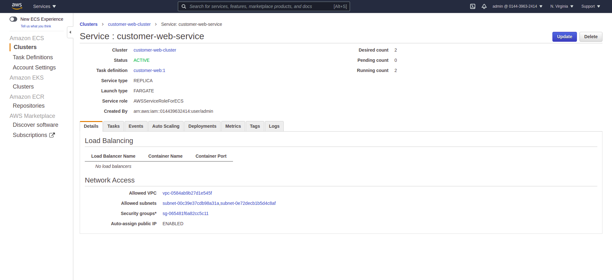

# Customer Web

* To run:

```
$ docker-compose up
```

* Open in browse http://localhost:9000

* Technologies Used:
    1. Angular 9
    2. Docker 
    3. Docker compose
    4. AWS ECS
    5. CircleCI


Application:

<p align="center">
  
</p>

<p align="center">
  
</p>

<p align="center">
  
</p>

AWS Service:

<p align="center">
  
</p>

